# Konecta Week 7 (Jenkins)

This repository implements a complete CI/CD workflow with **Jenkins**, **Terraform**, **Ansible**, **Docker**, and a **daily cleanup job**.

It consists of three Jenkins pipelines:

| Pipeline | File | Trigger | Purpose |
|----------|------|--------|--------|
| **Provision & Configure** | `Jenkinsfile.provision` | Git webhook on `main` | Creates an ephemeral EC2 and installs Docker |
| **Build, Push & Deploy** | `Jenkinsfile.deploy` | Auto after Pipeline 1 | Builds/pushes custom Nginx image, deploys to EC2 |
| **Daily Cleanup** | `Jenkinsfile.cleanup` | `0 0 * * *` (Africa/Cairo) | Terminates all ephemeral EC2 instances |

---

## 1️⃣  Pipeline 1 — Provision & Configure

**Flow**

1. `terraform init` (remote backend).
2. `terraform apply` creates `t2.micro` EC2 with tags  
   `Name=ci-ephemeral`, `lifespan=ephemeral`, `owner=jenkins`.
3. Outputs `public_ip`.
4. Runs Ansible playbook to install & enable Docker.

### Evidence to Capture
| What to show | Suggested screenshot/clip |
|-------------|----------------------------|
| Git push triggering Jenkins build | 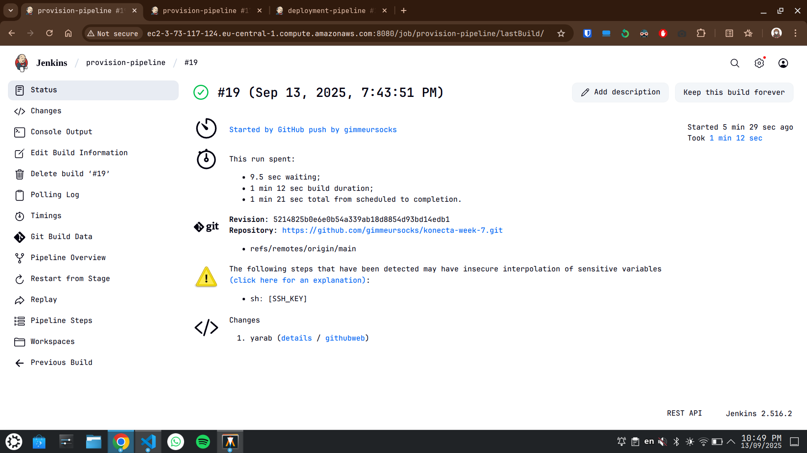 |
| Terraform `apply` output with instance ID & tags | 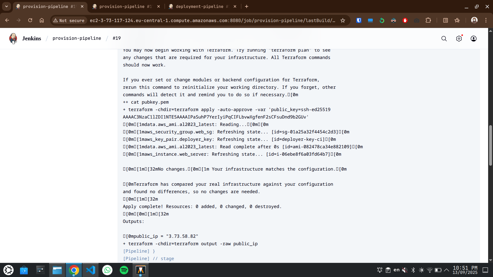 |
| Jenkins console log showing Ansible installing Docker | 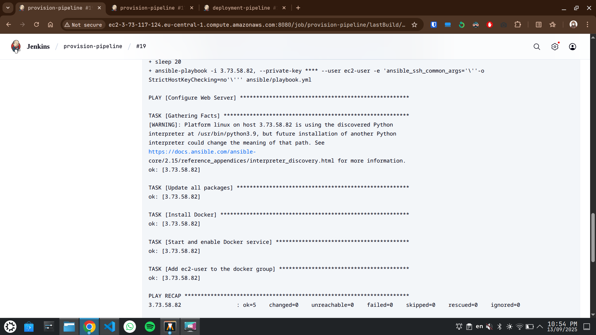 |
| EC2 console showing instance & tags | 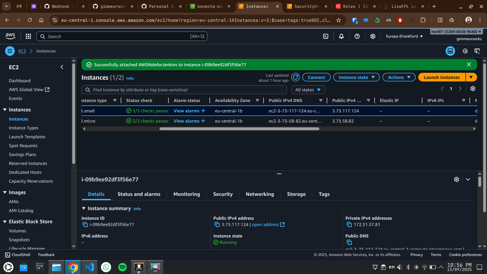 |

---

## 2️⃣  Pipeline 2 — Build, Push & Deploy

**Flow**

1. Builds Nginx image from `nginx:alpine`  
   with dynamic `index.html` (includes `BUILD_NUMBER` + timestamp).
2. Logs in to private Docker Hub (`docker.io/<namespace>/nginx-ci:<BUILD_NUMBER>`).
3. Pushes image.
4. SSH-deploys to `EC2_IP` (from Pipeline 1).
5. Runs container on port 80 and verifies with `curl`.

### Evidence to Capture
| What to show | Suggested screenshot/clip |
|-------------|----------------------------|
| Jenkins console log: image build & push success | 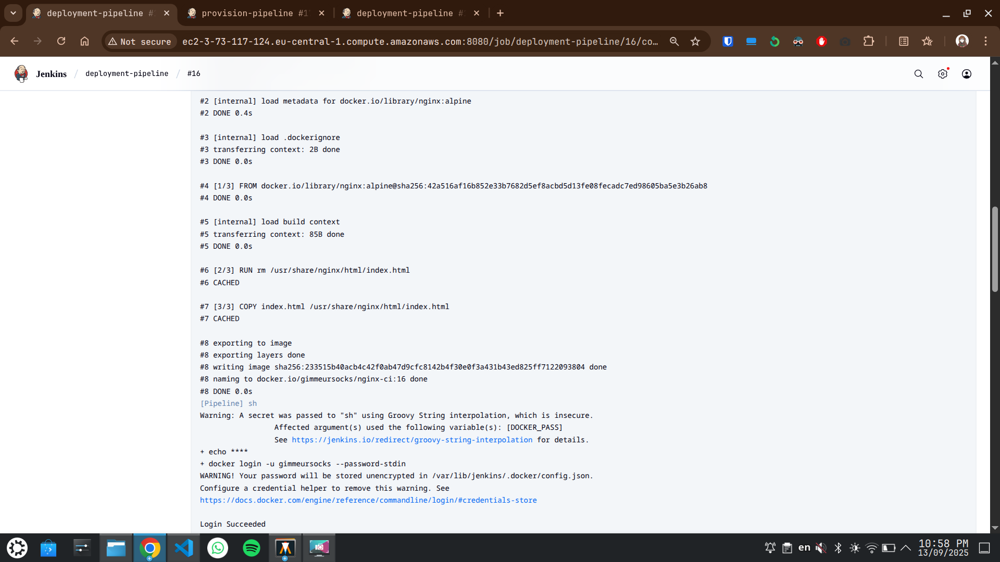 |
| Docker Hub repository page with the pushed tag | 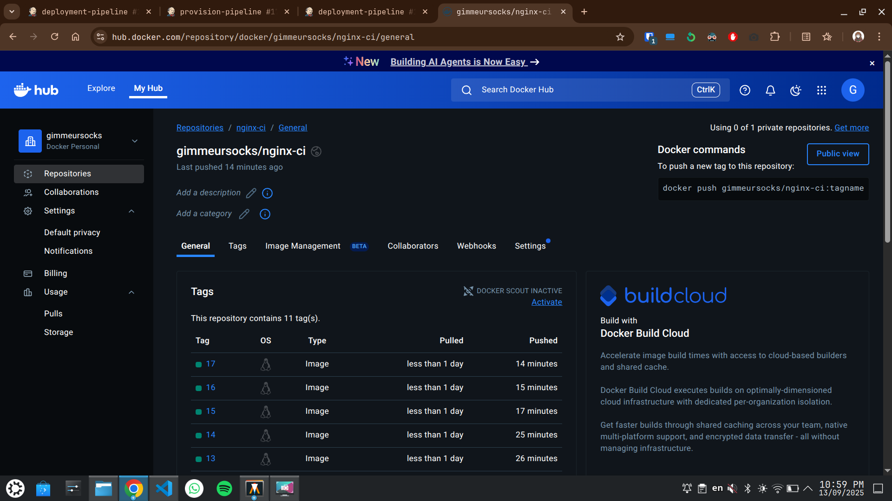 |
| Jenkins console log: SSH deployment + `curl` response | 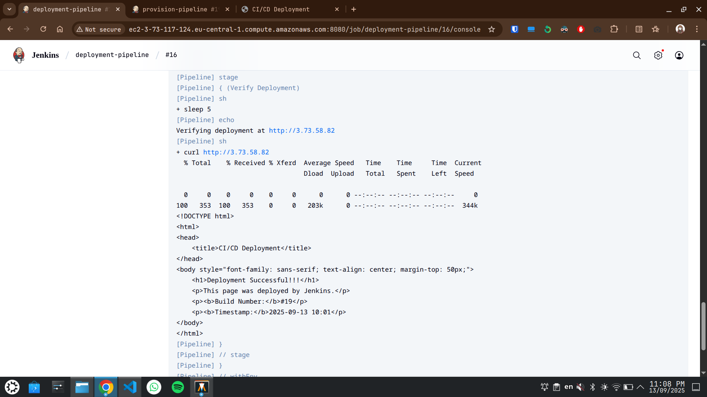 |
| Browser showing custom HTML page | 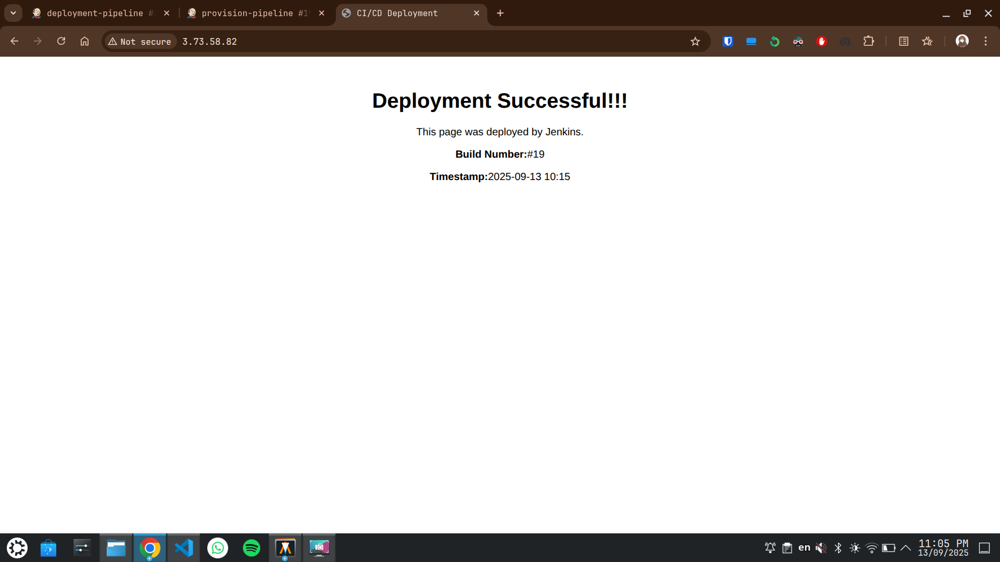 |

---

## 3️⃣  Pipeline 3 — Daily Cleanup

**Flow**

- Scheduled in Jenkins with:

```
cron('TZ=Africa/Cairo\n0 0 * * *')
```

- Uses AWS CLI and Jenkins AWS credentials.
- Terminates all instances with tag `lifespan=ephemeral`.

### Evidence to Capture
| What to show | Suggested screenshot/clip |
|-------------|----------------------------|
| Jenkins job configuration showing cron + TZ | 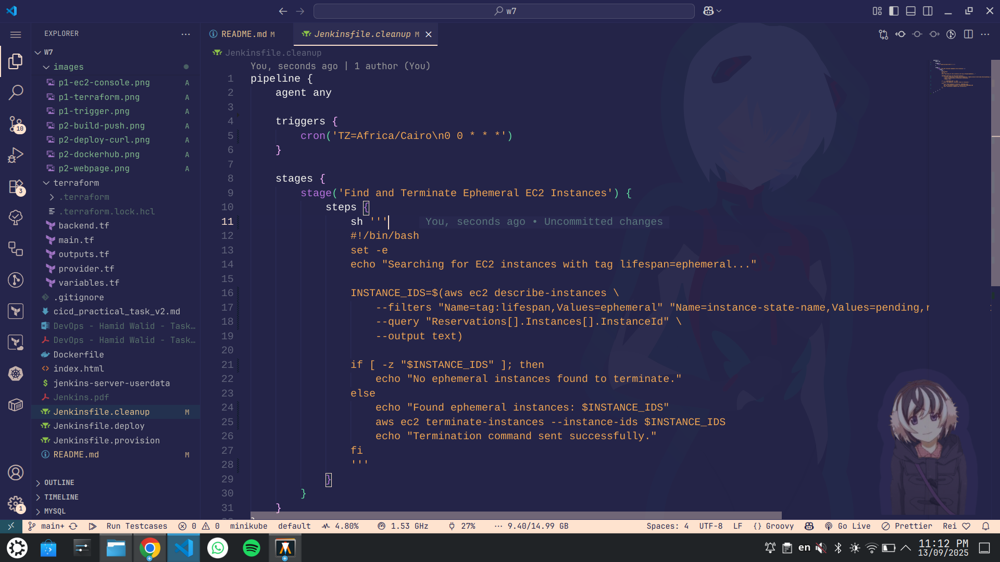 |
| Jenkins console log of cleanup run: lists & terminates instance IDs (or “none found”) | 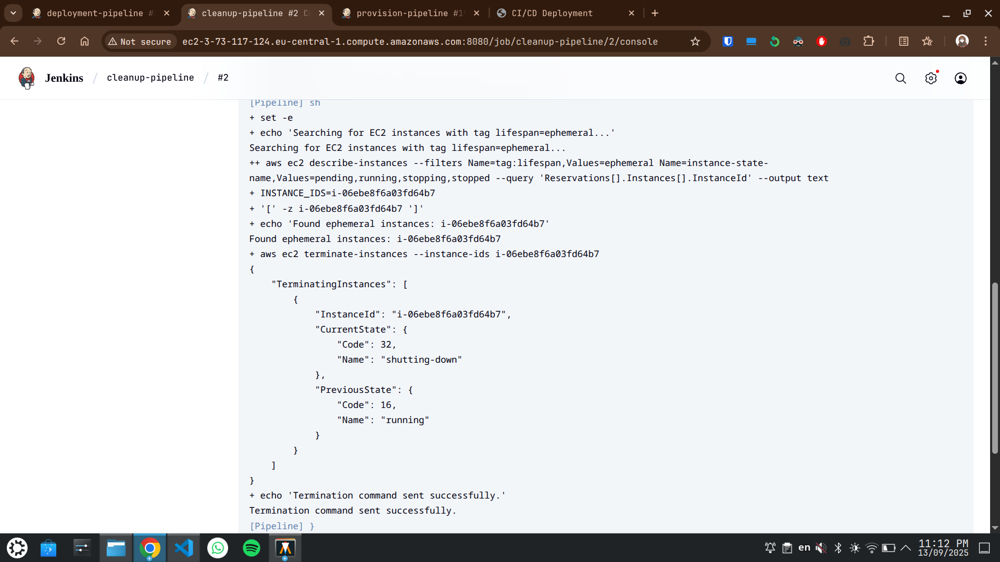 |
| AWS console showing terminated instances | 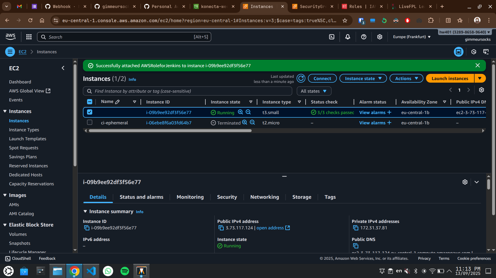 |

---

## Security & Credentials

- **Terraform** uses an **S3 remote backend** (see `terraform/backend.tf`).
- **Secrets** (SSH key, Docker Hub creds) are stored in **Jenkins Credentials Manager**.
- Jenkins Server runs on a manually launched EC2 instance (t3.small) that was bootstrapped using the jenkins-server-userdata script.
- The server has an IAM role attached directly to it, granting the cleanup job only the minimum required permissions: `ec2:DescribeInstances` and `ec2:TerminateInstances`.
